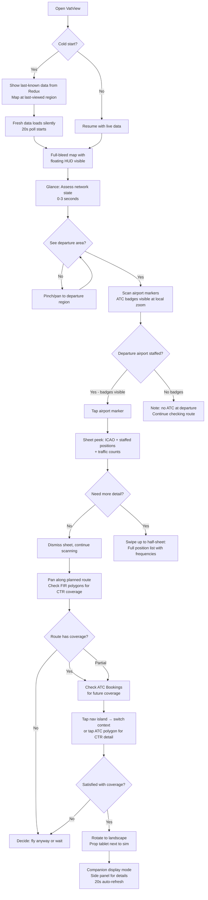
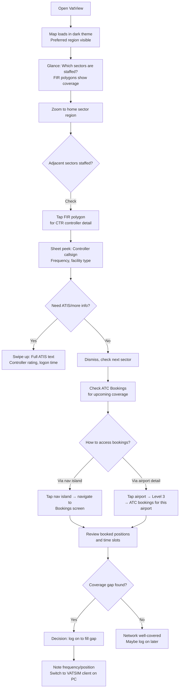
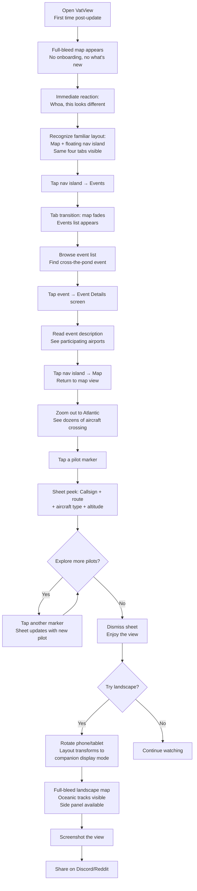
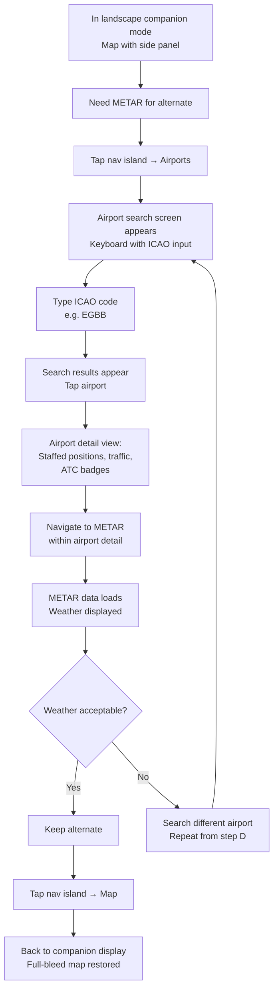
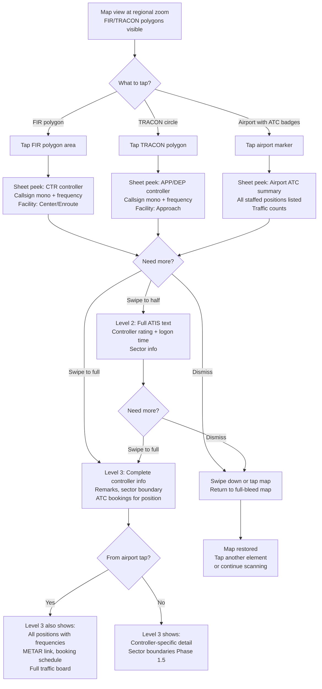
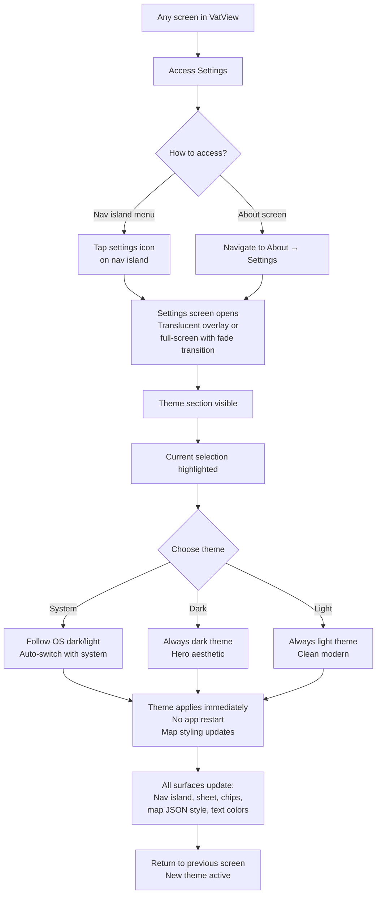
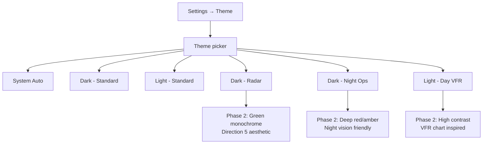

# UX Design Specification VatView

**Author:** Oren
**Date:** 2026-03-14

---

## Executive Summary

### Project Vision

VatView Phase 1 is a visual modernization of an established cross-platform mobile app (~3,000 active users, iOS + Android) that tracks live VATSIM network activity. The transformation replaces a functional but dated Material Design interface with an immersive "floating HUD" aviation experience — full-bleed edge-to-edge map, translucent frosted-glass UI elements, progressive disclosure, and light/dark theming. The goal is to elevate perceived quality to drive community buzz and organic growth (target: 4,500+ users) while laying architecture for Phase 2 (single-surface navigation, aviation themes, social features). Every existing feature must carry forward with zero functional regression.

### Target Users

**Priority 1 — Active VATSIM Pilots ("Pre-flight Planner") — Retention Engine**
Fly VATSIM weekly on PC/Mac. Use VatView on phone/tablet to check ATC coverage before and during sessions. Need quick ATC scans (1-2 min) and extended companion use (30+ min on tablet in landscape). Value speed to information and glanceable coverage maps. This is the primary persona: they drive daily engagement and retention. When design tradeoffs arise (e.g., bottom sheet layout optimized for pilot flight plans vs. ATC frequencies), this persona is the tiebreaker.

**Priority 2 — Spectators/Enthusiasts ("Armchair Watcher") — Acquisition Engine**
Former pilots, aviation fans, or curious newcomers who browse live traffic during events. Most likely to screenshot and share — the organic growth engine. Value visual delight and ease of casual exploration. Design decisions affecting visual impact (themes, map aesthetics, screenshot-worthiness) should weight this persona heavily.

**Priority 3 — VATSIM Controllers ("Controller on Break") — Power Users**
Control ATC positions on VATSIM. Check network state to plan sessions — which sectors are staffed, what's booked, where coverage gaps exist. Need to go from "open app" to "coverage decision" in under 30 seconds. Value clear staffing visibility and ATC booking access. Served well by a design that serves pilots well, with ATC-specific detail in the progressive disclosure layers.

**Shared traits:** All users are aviation enthusiasts, technically comfortable, using phones and tablets, often in a dual-screen context (flight sim on PC, VatView on mobile device).

### Key Design Challenges

1. **Migration without disorientation** — 3,000 active users have muscle memory with the current tab-based layout. The redesign must feel dramatically better without causing navigation confusion. No onboarding modals — the new design must be self-evident.

2. **Translucency vs. readability under variable map density** — Frosted glass floating over a map that ranges from sparse (oceanic) to extremely dense (European event with 1,500+ markers, overlapping TRACON polygons, and map labels). A static ~0.45 opacity may not work in all scenarios. The design must consider a **dynamic opacity strategy** — increasing background opacity or adjusting blur intensity when the underlying map is visually noisy — to guarantee text legibility (callsigns, frequencies, ATIS, flight plans) across both themes, all zoom levels, and peak density scenarios. BlurView performance on Android is an additional constraint.

3. **Progressive disclosure information architecture** — Three disclosure levels (glanceable → tap → pull up) for each client type (pilot, tower ATC, enroute ATC, airport). Must balance power-user efficiency (minimal taps) against visual decluttering (the whole point of the redesign). Persona priority ranking guides tradeoffs: pilot flight plan data gets prime placement.

4. **Navigation island discoverability** — Four current tabs plus modal and stack screens must be accessible from a compact floating pill. The current bottom tab bar is always visible and constantly advertises the app's full capability set (Events, Airports, List). A compact nav island risks hiding features — a first-time user landing on the map may never discover Events or ATC Bookings exist. The nav island must solve for **discoverability, not just compactness** — ensuring the app's breadth of features remains apparent without a tutorial.

5. **Tab transition continuity** — In Phase 1, switching from Map to List/Events/Airports tabs still navigates to full-screen views (true single-surface is Phase 2). The hard visual cut from an immersive map to a standard list screen could feel jarring in the context of the new HUD aesthetic. Transition design must bridge this gap.

### Design Opportunities

1. **Aviation instrument aesthetic** — No mobile competitor has this. Radar-scope-inspired visual language (monospaced callsigns, subtle glow on active sectors, dark theme as hero) transforms VatView from "utility app" to "aviation tool." Screenshots become shareable community content.

2. **Transition animations as Phase 2 seeds** — While full context-preserving navigation is a Phase 2 concern, Phase 1 can create the *perception* of a single-surface experience through deliberate transition design. Subtle map-fade animations when switching tabs (rather than hard cuts) give users the feeling of continuity at minimal architectural cost. This seeds the Phase 2 mental model and makes the eventual single-surface transition feel like a natural evolution, not a surprise.

3. **Companion display mode** — Landscape on tablet propped next to a flight simulator is a killer use case no competitor addresses. Designing specifically for this "ambient radar display" context — minimal chrome, maximum map, side panel for details — creates a unique product category.

## Core User Experience

### Defining Experience

The core VatView experience is **glance-and-assess**: the user opens the app and immediately understands the state of the VATSIM network through the map. Where is ATC staffed? Where are pilots flying? What's happening right now? This assessment happens in seconds, without navigation or interaction — the map tells the story at a glance.

The critical interaction that extends from this core is the **tap-to-discover flow**: the user sees something on the map (a pilot, a controller, an airport, a polygon), taps it, and gets useful context immediately in a translucent bottom sheet. Progressive disclosure then allows drilling deeper — but the first tap must always reward with meaningful information.

**Core loop:** Open → Glance (assess network state) → Tap (discover details) → Drill (progressive disclosure) → Return to map

This loop repeats dozens of times per session. Every design decision must serve it.

### Platform Strategy

**Dual form factor, both first-class:**

- **Phone (portrait)** — The primary quick-check device. Used for 1-2 minute pre-flight ATC scans, event browsing, and casual watching. Bottom sheet for detail panels. Floating nav island and filter chips positioned for one-handed thumb reach.
- **Tablet (portrait + landscape)** — The companion display. Used for extended 30+ minute sessions propped next to a flight simulator. Landscape with side panel for details. Minimal chrome, maximum map. This is the "ambient radar display" use case — a unique product category.
- **Both platforms:** iOS and Android via single React Native/Expo codebase. Touch-only interaction. No offline mode — VatView is a live data viewer; persisted Redux state provides last-known data on cold start.

**Design implication:** Every UI element must work at both phone and tablet scale. The floating HUD architecture is inherently responsive — floating elements reposition rather than reflow — making dual form factor support an architectural feature, not an afterthought.

### Effortless Interactions

These interactions must feel like zero cognitive effort:

1. **Instant network comprehension** — Opening the app and immediately seeing the live state. No loading screens blocking the map, no navigation required. The full-bleed map with staffed sectors visible is the first and only thing the user sees. Last-known data displayed instantly on cold start while fresh data loads in the background.

2. **Every tap is meaningful** — Tapping any visible element (pilot marker, ATC polygon, airport marker) opens the bottom sheet with relevant context. No dead zones on interactive elements. No wrong taps. The map is a surface of discoverable information, not a static background.

3. **Seamless view transitions** — Moving between Map, List, Events, and Airports should feel like shifting perspective, not leaving and coming back. Transition animations (map fade rather than hard cut) preserve the sense of a single coherent experience even though Phase 1 uses separate tab views.

4. **Theme follows context** — System theme preference detected automatically. Dark theme in a dim room during a sim session, light theme during daytime browsing. No manual configuration required (though manual override is available in Settings).

5. **Orientation just works** — Rotating the device smoothly transitions layout. No jarring reloads, no lost state. Bottom sheet becomes side panel, floating elements reposition, map fills available space.

### Critical Success Moments

1. **First launch after update (THE moment)** — An existing user opens VatView post-Phase 1 and their reaction is "whoa — and I immediately know where everything is." The visual transformation must be dramatic enough to generate a "wow" but familiar enough that no feature feels lost. This single moment determines whether Phase 1 succeeds or fails. No onboarding modal, no "what's new" screen — the design speaks for itself.

2. **First tap on a marker** — The bottom sheet slides up with frosted glass over the map. The user sees pilot details (or ATC info) clearly, and the map is still visible behind it. This is the moment the "floating HUD" concept clicks — "everything floats, the map is always there."

3. **First landscape rotation on tablet** — The layout transforms into a radar-scope companion display. The user realizes this isn't just a phone app stretched to tablet — it's designed for this exact use case. This is the screenshot moment.

4. **First event discovery** — A user navigates to Events via the floating nav island and finds a live event with hundreds of aircraft. They return to the map and see the traffic. The nav island has just proven its worth — the app's breadth of features is discoverable without a tab bar.

5. **The share moment** — A user screenshots the full-bleed dark-theme map during a busy event, with translucent HUD elements and oceanic tracks visible. The image looks like a real radar display, not a mobile app. They share it on Discord/Reddit. This is the acquisition engine firing.

### Experience Principles

These principles guide all UX decisions for Phase 1:

1. **The map is the app** — Every design choice must maximize map visibility. UI elements float over the map, never beside it. Chrome is translucent, never opaque. If a design decision reduces map real estate, it needs a compelling justification.

2. **Reward every interaction** — Every tap, swipe, and gesture must produce a meaningful response. No dead taps, no empty states without explanation, no interactions that feel like nothing happened. The app should feel alive and responsive.

3. **Progressive, not hidden** — Information is layered (glance → tap → drill), not hidden. The user should always feel that more detail is available if they want it, but never overwhelmed by default. "Show less, reveal more" — not "hide things."

4. **Familiar but elevated** — Existing users must recognize VatView immediately. The same four views, the same data, the same flows — wrapped in a dramatically better visual treatment. Evolution, not revolution. The mental model stays; the pixels change.

5. **Both screens are real** — Phone and tablet are equally important. No design that works on phone but degrades on tablet (or vice versa). The floating HUD architecture must serve both form factors natively, not through scaling or stretching.

## Desired Emotional Response

### Primary Emotional Goals

1. **Awe/Pride** — "This is *my* tool, and it's beautiful." The feeling evoked by a well-crafted aviation instrument panel — precision, quality, purpose. Not flashy consumer app polish, but the quiet confidence of something built by someone who cares deeply about the craft. Users should feel pride when showing VatView to a friend or posting a screenshot. The aesthetic says: "this was made for pilots, by someone who gets it."

2. **Confidence/Trust** — "I trust this data." Visual polish is a proxy for maintenance quality. When a user checks ATC coverage before connecting to VATSIM, the frosted glass, smooth animations, and consistent theming all signal: "this app is maintained, this data is accurate, this tool is reliable." The redesign doesn't just look better — it *feels* more trustworthy.

3. **Flow/Immersion** — The radar-scope state during extended companion use. The map fills the screen, data updates silently, the translucent HUD provides information without demanding attention. Time disappears. The user is watching the network, not operating an app. This is the emotional state that turns a 2-minute check into a 30-minute session.

### Emotional Journey Mapping

| Stage | Target Emotion | Design Driver |
|---|---|---|
| **First launch after update** | Surprise + Recognition | Dramatic visual change + zero navigation confusion. "Whoa — and I know exactly where everything is." Both halves must land simultaneously. |
| **Glance at map** | Calm authority | Full-bleed map with clear visual hierarchy. Network state comprehensible at a glance. No clutter competing for attention. |
| **Tap a marker** | Satisfying discovery | Bottom sheet slides up with frosted glass. Information appears immediately. The map stays visible behind. "Everything floats." |
| **Drill into details** | Focused engagement | Progressive disclosure rewards curiosity. Each level reveals more without overwhelming. The user feels in control of depth. |
| **Switch tabs (nav island)** | Seamless continuity | Transition animation preserves spatial context. Moving to Events or List feels like shifting perspective, not leaving the map. |
| **Rotate to landscape** | Delight + belonging | "This was designed for exactly what I'm doing right now." The companion display layout validates the tablet-next-to-sim use case. |
| **Something goes wrong (stale data, API down)** | Informed patience | Clear stale-data indicator. Last-known state still visible and useful. No panic, no blank screens. "I see the problem, and the app is handling it." |
| **Share a screenshot** | Pride + evangelism | The image looks like a real radar display, not a mobile app screenshot. The user feels they're sharing something impressive, not just functional. |
| **Return next session** | Comfortable familiarity | The app remembers map position, theme preference, last state. Reopening feels like coming back to your desk, not starting over. |

### Micro-Emotions

**Actively cultivate:**

- **Confidence over confusion** — Every element has clear purpose. Nothing feels mysterious or accidental. Users always know what they're looking at and what they can do next.
- **Delight over mere satisfaction** — The frosted glass, the smooth transitions, the responsive floating elements — these create micro-moments of delight that compound into overall product love. Satisfaction says "it works." Delight says "I love using this."
- **Trust over skepticism** — Consistent visual language, predictable interactions, reliable data updates. The design never lies about what it is or what it can do.
- **Accomplishment over frustration** — Finding ATC coverage, discovering an event, checking a METAR — every completed task should feel effortless, not hard-won.

**Actively prevent:**

- **Confusion** — "Where did that feature go?" Migration disorientation is the #1 emotional risk. Every current feature must be findable without searching.
- **Cheapness** — "This blur is stuttering." If the frosted glass effect drops frames on any device, it destroys the entire premium illusion. Performance is an emotional requirement, not just a technical one.
- **Frustration** — "I can't read this text over the map." Translucency readability failure turns a design strength into an annoyance.
- **Abandonment** — "This app used to be simpler." If the redesign feels like complexity added rather than polish applied, power users will feel the app moved away from them.

### Design Implications

| Emotional Goal | UX Design Approach |
|---|---|
| **Awe/Pride** | Dark theme as hero aesthetic. Monospaced callsigns. Subtle glow on active sectors. Custom map styling that looks like a real radar scope. Every pixel intentional. |
| **Confidence/Trust** | Consistent translucency across all surfaces. No visual glitches or inconsistencies. Data freshness always visible. Smooth 60fps animations. No loading spinners blocking the map. |
| **Flow/Immersion** | Minimal chrome in companion display mode. Silent 20-second data updates (no refresh indicators unless stale). Floating elements that recede from attention when not needed. |
| **Surprise + Recognition** | No onboarding or "what's new." Same four views, same data hierarchy, same tap targets — wrapped in dramatically better visuals. The mental model stays; the pixels transform. |
| **Prevent cheapness** | Dynamic opacity fallback if blur performance degrades. Test on oldest supported devices. A clean semi-transparent background is better than a stuttering blur. |
| **Prevent confusion** | Nav island shows all four views clearly. Feature parity is non-negotiable. If a user could find it before, they can find it now — in fewer taps if possible. |

### Emotional Design Principles

1. **Instrument, not toy** — The emotional register is precision and craft, not playfulness or whimsy. Animations are purposeful (slide, fade, transition), never decorative (bounce, wobble, confetti). The vibe is cockpit instrument panel, not consumer app onboarding.

2. **Quiet confidence** — The design doesn't shout. No splash screens announcing the redesign, no tooltips explaining new features, no badges drawing attention to changes. The quality is self-evident. Users notice because it's beautiful, not because it's noisy.

3. **Performance is emotion** — A 60fps animation creates delight. A dropped frame creates doubt. A stutter during blur creates cheapness. Performance isn't a technical metric — it's the difference between "premium" and "trying to look premium." If an effect can't run smoothly, cut it.

4. **Familiarity is comfort** — The emotional safety net. Every radical visual change is grounded in a familiar interaction pattern. New pixels, same muscle memory. The user never has to relearn VatView — they just get to see it in a new light.

## UX Pattern Analysis & Inspiration

### Inspiring Products Analysis

**Volanta (Orbx) — Flight Tracker Companion**

Volanta is a cross-platform flight tracker (desktop + mobile) that VatView users admire. Key UX characteristics:

- **Map as foundation:** Almost every page in Volanta uses a full-screen map as its base layer. This validates VatView's "map is the app" principle — users in this domain expect the map to be the primary surface, not a tab among equals.
- **Progressive map detail:** GPU-rendered maps that add detail at higher zoom levels (airports → waypoints → airways). At low zoom, the map stays clean. This is directly relevant to VatView's density challenge — show less at global view, reveal more as users zoom into a region.
- **3D altitude visualization:** Map can toggle to 3D to show altitude information. While not in VatView's Phase 1 scope, this signals that the aviation audience values dimensional data representation.
- **Premium polish:** Clean typography, smooth rendering, professional aesthetic. Volanta doesn't look like a hobby project — it looks like a commercial aviation tool. This is the bar VatView's Phase 1 needs to clear.
- **Social engagement layer:** Challenges, badges, shared flights. Not in VatView's Phase 1, but confirms the Phase 2 social direction (friends, self-tracking) is what this audience wants.

**VATSIM Radar (vatsim-radar.com) — Web-Based VATSIM Tracker**

VATSIM Radar is the primary web alternative that VatView's users also use. Key UX characteristics:

- **Dark-first design:** Dark theme is the default, with a cohesive dark palette across all UI elements. This validates VatView's decision to treat dark theme as the "hero" aesthetic — the VATSIM community clearly prefers dark for this type of tool.
- **Hover/tap card pattern:** Pilots show a hover card on mouse-over (or tap on mobile), ATC shows a short card. This is a two-level progressive disclosure pattern — glanceable summary on hover, full detail on click/overlay. Similar to VatView's three-level model but with an interesting lightweight first touch.
- **Airport overlays with data density:** Airport dashboards show arrival rates with 15-minute splits, controller info, and flight cards. High information density, but organized in overlay panels rather than full-screen views.
- **VATGlasses integration:** Sector-level ATC visualization (bandbox/split detection) — a feature VatView plans for Phase 1.5. VATSIM Radar's implementation shows what the VATSIM community expects from ATC visualization.
- **Continuous UI redesign:** Recent updates focused on font, color, and design consistency — a "continuous UI look." This tells us the VATSIM community notices and values visual cohesion.
- **PWA, not native:** VATSIM Radar works on mobile as a web app but doesn't have native performance, offline state persistence, or the immersive full-screen experience of a native app. This is VatView's structural advantage.

### Transferable UX Patterns

**Navigation Patterns:**

- **Map-as-base (Volanta)** → Adopt directly. VatView's full-bleed map with floating UI elements aligns perfectly with Volanta's proven approach. The map should never be "one of the tabs" — it should be the persistent canvas.
- **Overlay panels over map (VATSIM Radar)** → Adapt. VATSIM Radar shows airport data and flight details as overlays on the map rather than separate screens. VatView's bottom sheet / side panel approach is the native mobile equivalent of this pattern.

**Interaction Patterns:**

- **Progressive map detail on zoom (Volanta)** → Adopt. Show fewer labels, simplified markers, and no TRACON polygons at global zoom. Progressively add detail as the user zooms in. This directly addresses the density/readability challenge.
- **Lightweight first-touch card (VATSIM Radar)** → Adapt. VATSIM Radar's hover card provides a glanceable summary before full detail. VatView's Level 1 progressive disclosure (glanceable info in the bottom sheet peek) should serve the same purpose — the first tap gives you enough to decide if you want more.
- **Bookmarks/favorites (VATSIM Radar)** → Note for Phase 2. Users want to save favorite airports or locations. Not in Phase 1 scope, but the nav island architecture should accommodate this later.

**Visual Patterns:**

- **Dark-first aesthetic (both)** → Adopt. Both apps VatView's users love default to dark themes. VatView's dark theme should be the hero in marketing materials, screenshots, and the default for new users following system preference.
- **Cohesive visual language (VATSIM Radar redesign)** → Adopt. VATSIM Radar's recent redesign focused on font/color consistency. VatView's NativeWind design token system must enforce this same consistency — every surface, every card, every text element flowing from the same token set.
- **Premium aviation aesthetic (Volanta)** → Adopt the quality bar. Volanta proves the flight sim community will engage with a polished, professional-looking tool. VatView's Phase 1 must match or exceed this quality level to compete.

### Anti-Patterns to Avoid

1. **Web-app-on-mobile feel** — VATSIM Radar on mobile feels like a responsive web app, not a native experience. Touch targets are sometimes small, scrolling isn't native, and there's no hardware back button integration. VatView must feel unmistakably native — native gestures, native scrolling, native sheet physics. This is VatView's core advantage.

2. **Information overload at global zoom** — Both Volanta and VATSIM Radar can get visually noisy when showing all pilots, all ATC, all airports simultaneously at low zoom. VatView's floating filter chips and progressive map detail should prevent this — but the default state must be curated, not everything-on.

3. **Flat cards without depth** — Many aviation apps use flat, opaque information cards that feel disconnected from the map beneath them. VatView's translucent frosted-glass treatment should create depth and connection — the map is always present beneath the information layer, creating a layered "instrument panel" feel rather than a card-on-background feel.

4. **Hidden features behind menus** — VATSIM Radar's feature richness (bookmarks, friends, filters, layers) can be hard to discover. Many features live behind settings menus or icons that new users won't find. VatView's nav island must advertise the app's breadth, and filter chips must be visible by default on the map view.

### Design Inspiration Strategy

**Adopt directly:**

- Map as persistent foundation (Volanta pattern) — because it's the proven approach for this domain and aligns with "the map is the app" principle
- Dark-first aesthetic (both apps) — because VatView's users clearly prefer dark themes for aviation tools
- Progressive map detail on zoom (Volanta) — because it solves the density challenge elegantly

**Adapt for VatView:**

- Overlay panels (VATSIM Radar) → VatView's translucent bottom sheet / side panel — same concept, native mobile execution with frosted glass depth
- Hover card (VATSIM Radar) → VatView's Level 1 progressive disclosure — the first tap equivalent of a hover, providing glanceable summary
- Premium polish level (Volanta) → VatView must match this quality bar but with a distinctly aviation-instrument aesthetic rather than Volanta's clean-commercial look

**What to avoid:**

- Web-app-on-mobile feel — VatView's native advantage must be felt in every gesture and animation
- Everything-on-by-default — curate the default map state; let users add layers, not remove clutter
- Flat opaque cards — VatView's translucent depth is the visual differentiator; never fall back to flat cards unless forced by performance

## Design System Foundation

### Design System Choice

**Custom Design System built on NativeWind/Tailwind primitives** — a utility-first foundation powering a fully custom aviation HUD component library. No off-the-shelf component library is used for visible UI elements. Every user-facing component is custom-designed to achieve the translucent floating instrument aesthetic.

**Stack:**

- **NativeWind v4** (Tailwind CSS for React Native) — utility classes, responsive values, dark mode variant support
- **Tailwind config** — design token source of truth for colors, spacing, typography, opacity, blur values, animation timing
- **Custom components** — every visible element (nav island, bottom sheet chrome, filter chips, cards, list items) built from Tailwind utilities
- **@gorhom/bottom-sheet** — retained for sheet physics and gesture handling; chrome/styling is custom
- **react-native-reanimated** — animation engine for transitions, sheet animations, and layout morphing

### Rationale for Selection

1. **No existing library fits the vision** — The aviation HUD aesthetic (translucent frosted glass, floating elements, radar-scope styling) doesn't exist in any React Native component library. Material Design, Ant Design, and similar systems would fight the vision rather than serve it.

2. **Token-first architecture enables Phase 2 themes** — Tailwind's config-driven token system means light theme, dark theme, and future aviation themes (Day VFR, Night Ops, Radar) are configuration changes, not component rewrites. Every color, opacity, blur radius, spacing value, and animation timing flows from tokens.

3. **Solo developer + AI efficiency** — Tailwind utility classes are the fastest way for a solo developer with AI-assisted coding to build consistent components. No need to learn a component library's API or fight its opinions. Write the styles you want, directly.

4. **NativeWind handles responsive + dark mode natively** — `dark:` variant for theming, responsive breakpoints for phone/tablet/landscape adaptation. The framework does the heavy lifting for the two hardest cross-cutting concerns.

5. **Migration path from react-native-paper is clean** — NativeWind and StyleSheet.create() can coexist during incremental migration. Components can be migrated one at a time without breaking the app.

### Implementation Approach

**Pre-migration validation (MUST complete before any component work):**

1. **NativeWind + react-native-maps compatibility** — Validate that NativeWind utility classes (especially `overflow`, `z-index`, absolute positioning) work correctly on map overlay components. If incompatible, map overlays retain StyleSheet.create() while all non-map components use NativeWind.
2. **NativeWind + @gorhom/bottom-sheet compatibility** — Validate className props on sheet content wrappers.

**Migration sequence:**

1. **Install NativeWind + Tailwind config** — Set up the full token system including animation tokens
2. **Build core custom components** — TranslucentSurface, MapOverlayGroup, ThemedText, NavIsland, FilterChip — the building blocks
3. **Migrate screens bottom-up** — Leaf components first (text, buttons, cards), then containers, then screens. **Never mix NativeWind className and StyleSheet.create() within a single component** — a component is fully migrated or not at all.
4. **Remove react-native-paper** — Once all components are migrated, remove the dependency entirely

**Coexistence rules:** During migration, NativeWind-styled components and legacy StyleSheet.create() components can render side by side *at the screen level* (a NativeWind card inside a legacy screen is fine). But within a single component file, use one system only. Migrate bottom-up to avoid layout conflicts from mixed style inheritance.

### Customization Strategy

**Design Token Architecture:**

```
tailwind.config.js (source of truth)
├── colors
│   ├── surface: { base, elevated, overlay } — translucent surface colors per theme
│   ├── text: { primary, secondary, muted } — text hierarchy per theme
│   ├── accent: { primary, secondary } — brand accent (evolved from #2a5d99)
│   ├── atc: { staffed, unstaffed, tracon, fir, uir } — aviation-domain semantic colors
│   └── status: { online, offline, stale } — data state indicators
├── opacity
│   ├── surface: 0.45 — default translucent surface
│   ├── surface-dense: 0.65 — increased for dense map backgrounds
│   └── overlay: 0.85 — near-opaque for full-detail panels
├── blur
│   ├── surface:
│   │   ├── ios: 20 — native UIVisualEffectView backdrop blur
│   │   └── android: 0 — no blur; solid translucency is the intentional design
│   └── note: "Android uses semi-transparent surfaces with subtle border.
│             This is a permanent platform design decision, not a fallback."
├── animation
│   ├── duration:
│   │   ├── fast: 150ms — micro-interactions (chip toggle, state changes)
│   │   ├── normal: 250ms — panel transitions, tab switches
│   │   └── slow: 400ms — sheet open/close, layout morphs (orientation change)
│   ├── easing:
│   │   └── default: cubic-bezier(0.2, 0, 0, 1) — smooth deceleration, no bounce
│   └── spring:
│       └── sheet: { damping: 20, stiffness: 300 } — bottom sheet physics config
├── spacing — consistent spacing scale
├── borderRadius — rounded corners for floating elements
├── fontFamily
│   ├── sans: system font — UI text
│   └── mono: monospace — callsigns, frequencies, ICAO codes
└── screens — responsive breakpoints for phone/tablet/landscape
```

**Platform-Aware Blur Strategy:**

The translucent surface treatment is intentionally different per platform — not a degradation, but two premium expressions of the same design intent:

- **iOS:** Native backdrop blur via `UIVisualEffectView` (through `expo-blur`). Hardware-accelerated, essentially free. Multiple overlapping blur layers (nav island + filter chips + bottom sheet) render smoothly.
- **Android:** Semi-transparent solid background with subtle 1px border and slight elevation shadow. No blur applied. Designed to look intentionally premium — a clean glass-panel aesthetic rather than a "blur that couldn't run." This is a permanent platform design decision driven by the reality that Android's software blur cannot reliably render at 60fps across multiple overlapping surfaces on the current React Native stack.

Both platforms use the same opacity tokens and color values. The visual distinction is blur vs. clean transparency — the information hierarchy, contrast ratios, and overall feel remain consistent.

**Custom Component Library (Phase 1):**

| Component | Purpose | Key Properties |
|---|---|---|
| `TranslucentSurface` | Base wrapper for all floating elements | Platform-aware blur (iOS) / solid translucency (Android), opacity from tokens, border radius, theme-aware |
| `MapOverlayGroup` | Layout orchestrator for all floating elements on map view | Manages z-ordering, spatial relationships, and coordinated repositioning of nav island, filter chips, detail sheet, and stale indicator. Adapts layout when: sheet state changes (peek/half/full), orientation changes (portrait/landscape), nav island auto-hides. Single source of truth for floating element positions. |
| `NavIsland` | Floating navigation pill | Tab items, active indicator, auto-hide, positioned by MapOverlayGroup |
| `FilterChip` | Floating map filter toggle | On/off state, translucent background, positioned by MapOverlayGroup |
| `DetailSheet` | Bottom sheet chrome wrapper | Three snap points (peek/half/full), frosted glass, notifies MapOverlayGroup of state changes |
| `SidePanel` | Landscape detail panel | Same content as DetailSheet, side-anchored, managed by MapOverlayGroup |
| `ThemedText` | Typography with theme + mono support | Variant (heading/body/caption/callsign), theme-aware |
| `ClientCard` | Pilot/ATC summary in sheet peek | Callsign (mono), key info, progressive disclosure cue |
| `AirportCard` | Airport summary with ATC status | ICAO, staffed positions, traffic count |
| `EventCard` | Event list item | Event name, time, banner image |
| `StaleIndicator` | Data freshness warning | Subtle, non-blocking, theme-aware, positioned by MapOverlayGroup |

**Animation Standards:**

All animations follow the "instrument, not toy" principle — purposeful motion that communicates state changes, never decorative:

- **Micro-interactions** (150ms / `duration.fast`) — Filter chip toggle, state indicator changes, active tab highlight shift. Snappy and immediate.
- **Panel transitions** (250ms / `duration.normal`) — Tab switch animations (map fade), nav island show/hide, filter bar collapse/expand. Smooth and deliberate.
- **Layout morphs** (400ms / `duration.slow`) — Bottom sheet open/close, orientation layout transition, side panel slide. Weighted and confident.
- **Easing:** All transitions use smooth deceleration (`cubic-bezier(0.2, 0, 0, 1)`) — elements arrive with weight, never bounce or overshoot. The only exception is the bottom sheet, which uses spring physics (`damping: 20, stiffness: 300`) for natural gesture-driven feel via react-native-reanimated.

**Google Maps Styling:**

Two custom JSON style sets (extending the existing blueGrey pattern in `theme.js`):

- **Dark theme map:** Deep navy/charcoal base, subtle road lines, muted labels. Optimized for staffed-sector polygon visibility and pilot marker contrast.
- **Light theme map:** Soft grey/white base, gentle road lines, muted labels. Clean backdrop for translucent UI elements.

Both styles suppress Google Maps' default bright colors to keep the map visually subordinate to VatView's data layers (markers, polygons, HUD elements).

## Defining Experience

### The Defining Interaction

**"See the whole VATSIM world at a glance, then tap anything to go deeper."**

This is the interaction users will describe to friends: "You open it and the whole network is right there — tap anything and you get the details." The defining experience is not any single feature (events, bookings, METAR) — it's the *quality of the primary loop*: glance at the map, understand the network state, tap to discover, drill for detail, return to map. If this loop feels effortless and beautiful, VatView succeeds. If any friction exists in this loop, nothing else matters.

**The one-sentence pitch:** VatView is a live aviation radar in your pocket — tap anywhere to learn more.

### User Mental Model

**What users bring to VatView:**

VATSIM users think in map terms. Their mental model is: **the map is the truth, everything else is annotation.** This mental model is formed by years of using desktop tools (vPilot, EuroScope, VATSpy) and web tools (VATSIM Radar, SimAware) where the map is the primary surface and data overlays provide context.

**How users currently solve this problem:**

- **Desktop (during sim session):** VATSpy, SimAware, or VATSIM Radar open in a browser tab alongside the sim. Map-centric, click to explore.
- **Mobile (quick check):** VatView or VATSIM Radar PWA on phone. Quick glance, pinch-zoom, tap for details.
- **Tablet (companion):** VATSIM Radar in a browser, or VatView. Propped next to the sim for continuous monitoring.

**What users love about existing solutions:**

- VATSIM Radar's dark-first, data-rich map with hover cards for quick info
- Volanta's premium polish and full-screen map foundation
- VatView's native speed, aircraft-type icons, and ATC booking integration (features no web tool matches)

**What frustrates users about existing solutions:**

- VatView's current chrome congestion — the map feels subordinate to UI bars
- VATSIM Radar's web-app-on-mobile feel — not native, touch targets too small
- All tools show too much by default at global zoom — visual overload

**Where the current VatView breaks the mental model:**

The opaque bottom tab bar and app bar make the map feel like *one feature among four tabs*. Users think "map is everything" but the app says "map is tab 1 of 4." The tab bar constantly occupies valuable map real estate. Phase 1 resolves this by making the map omnipresent and navigation a lightweight floating overlay.

### Success Criteria

The defining experience succeeds when:

1. **Instant comprehension** — User opens the app and understands the network state within 3 seconds. No scanning, no navigating, no waiting. The map tells the story at a glance.

2. **Every tap rewards** — Tapping any visible element (pilot, controller, airport, polygon) immediately produces useful information in the bottom sheet. Zero dead taps. The response time from tap to sheet-open must feel instantaneous (<150ms perceived).

3. **Depth without commitment** — The three-level progressive disclosure (peek → half → full) lets users choose their depth of engagement. A quick peek at a callsign requires no more effort than a single tap. Full flight plan detail is two gestures away, not two screens away.

4. **Return to map is instant** — Dismissing the bottom sheet (swipe down or tap map) returns to the full-bleed map immediately. The user never feels "stuck" in a detail view. The map is always one gesture away.

5. **The map never disappears** — Even with the bottom sheet at full height, the map peeks above. Even when viewing Events or List, transition animations maintain spatial continuity. The user always knows "the map is right there."

6. **"This looks like a radar scope"** — The visual quality of the map + floating HUD creates the aviation instrument feeling. This is not a measurable criterion — it's a gut check. If someone screenshots the dark theme map with translucent overlays and the image looks like it could be a real ATC radar display, the visual target is hit.

### Novel UX Patterns

**Pattern classification: Established patterns combined in a novel way.**

The individual components are all proven patterns:

| Pattern | Source | Established In |
|---|---|---|
| Full-bleed map as primary surface | Google Maps, Volanta, FlightRadar24 | Map applications |
| Tap marker → bottom sheet | Google Maps, Apple Maps | Mobile map apps |
| Progressive disclosure (peek/half/full) | Apple Maps, Uber, @gorhom/bottom-sheet | iOS native patterns |
| Floating action controls over map | Google Maps (FAB), Waze (report button) | Mobile map apps |
| Dark theme with custom map styling | VATSIM Radar, Waze night mode | Map-heavy apps |

**The novel combination:**

What no existing app does — and what defines VatView Phase 1 — is combining all of these with **translucent frosted-glass floating elements** to create a layered depth effect. The user isn't opening panels *on top of* the map — they're looking *through* the panels to the map beneath. This perceptual shift from "app with a map view" to "aviation instrument with transparent overlays" is the innovation. It's not a new interaction pattern — it's a new *feeling* applied to established patterns.

**Teaching requirement: Zero.** Every interaction (tap, swipe, pinch) uses patterns mobile users already know. The translucent HUD is purely visual — it changes how the app *feels*, not how it *works*. No tutorial, no onboarding, no "what's new" modal. Users recognize every gesture; they just experience it in a dramatically better visual context.

### Experience Mechanics

**The Core Loop — Step by Step:**

**1. Initiation: Open the App**

- App opens directly to the full-bleed map. No splash screen beyond the OS-required launch image. Last-known data renders instantly from persisted Redux state while fresh data loads silently in the background.
- The map shows the user's last-viewed region (persisted map camera position). Familiar territory — they pick up where they left off.
- Floating elements are immediately visible: nav island at bottom-center, filter chips at top, stale indicator only if data is old.

**2. Glance: Assess Network State (0-3 seconds)**

- The map communicates network state through visual density: staffed sectors show FIR/TRACON polygons, pilot markers show traffic density, airport markers indicate active ATC.
- The user does not need to interact. The glance tells them: "Europe is busy tonight, there's an event at Heathrow, coverage on the eastern seaboard looks thin."
- Dark theme enhances this: staffed sectors glow against the dark map, unstaffed areas recede. The visual hierarchy does the work.

**3. Tap: Discover Details**

- User taps any element: pilot marker, ATC polygon, airport marker.
- The bottom sheet slides up to **peek position** (Level 1 — glanceable). Frosted glass, map visible beneath.
  - **Pilot peek:** Callsign (mono), aircraft type, departure → arrival, altitude, groundspeed
  - **ATC peek:** Callsign (mono), frequency, facility type, ATIS status indicator
  - **Airport peek:** ICAO/name, number of staffed positions, arriving/departing count
- Animation: `duration.slow` (400ms), spring physics. The sheet arrives with weight, not a snap.

**4. Drill: Progressive Disclosure (optional)**

- User swipes up to **half position** (Level 2 — moderate detail):
  - **Pilot:** Full flight plan (route string), time enroute, distance remaining, altitude chart
  - **ATC:** Full ATIS text, controller rating, logon time
  - **Airport:** List of staffed positions with frequencies, traffic list
- User swipes up further to **full position** (Level 3 — complete detail):
  - **Pilot:** Server info, transponder, remarks, flight plan amendments
  - **ATC:** Sector boundary info (Phase 1.5), historical coverage
  - **Airport:** METAR link, ATC bookings for this airport, full traffic board
- At any level, the map remains partially visible above the sheet. The user never loses spatial context.

**5. Return: Back to Map**

- User swipes the sheet down or taps the map above the sheet.
- Sheet dismisses with spring animation. Full-bleed map restored.
- The return is instant — no transition delay, no loading. The map was always there, just partially occluded.

**6. Navigate: Explore Other Views (via Nav Island)**

- User taps a different tab on the floating nav island (List, Airports, Events).
- Transition: map fades (not hard-cuts) to the new view (`duration.normal`, 250ms). The fade creates perceptual continuity.
- In the new view, the nav island remains visible. The user can return to the map with one tap.
- In landscape, non-map views may use split layout (list + map preview) where feasible.

**7. Loop: Repeat**

- User returns to map and repeats: glance → tap → drill → return.
- Each iteration takes 5-15 seconds for a quick check, or the user stays in drill mode for extended exploration.
- The 20-second data refresh happens silently — markers update, polygons adjust, no refresh indicator unless data is stale.

## Visual Design Foundation

### Color System

**Philosophy:** The color system serves the "aviation instrument" aesthetic — a restrained, professional palette where the map and data are the stars, and the UI chrome recedes. Colors are functional first, decorative never.

**Accent Color Evolution:**

The current `#2a5d99` (blue-grey) evolves into a slightly cooler, more luminous accent that reads better against both dark and light translucent surfaces:

- **Primary accent:** `#3B7DD8` — a cleaner, slightly brighter aviation blue. More visible against dark backgrounds, more distinctive against light. Retains the blue-grey family but with more presence.
- **Secondary accent:** `#5BA0E6` — lighter variant for hover states, active indicators, and subtle highlights on dark theme.
- **Accent usage rule:** Accent color is used *sparingly* — active nav island tab indicator, selected filter chip border, interactive element highlights. It should feel like a single instrument backlight color, not a brand paint job.

**Dark Theme Palette (Hero Theme):**

| Token | Value | Usage |
|---|---|---|
| `surface.base` | `#0D1117` | App background behind map, non-map screen backgrounds |
| `surface.elevated` | `rgba(22, 27, 34, 0.45)` | Translucent floating surfaces (nav island, filter chips, sheet) |
| `surface.elevated-dense` | `rgba(22, 27, 34, 0.65)` | Increased opacity for dense map backgrounds |
| `surface.overlay` | `rgba(22, 27, 34, 0.85)` | Near-opaque for full-detail sheet, non-map screens |
| `surface.border` | `rgba(255, 255, 255, 0.08)` | Subtle 1px border on floating elements |
| `text.primary` | `#E6EDF3` | Primary text — headings, callsigns, key data |
| `text.secondary` | `#8B949E` | Secondary text — labels, descriptions, metadata |
| `text.muted` | `#484F58` | Tertiary text — timestamps, low-priority info |
| `accent.primary` | `#3B7DD8` | Active states, selected indicators |
| `accent.secondary` | `#5BA0E6` | Hover/focus states, subtle highlights |
| `atc.staffed` | `#3B7DD8` | Staffed ATC polygon fill (primary accent, low opacity) |
| `atc.tracon` | `#2EA043` | TRACON polygon fill — distinct from FIR |
| `atc.fir` | `#3B7DD8` | FIR boundary stroke |
| `atc.uir` | `#A371F7` | UIR boundary stroke — purple to distinguish from FIR blue and TRACON green |
| `status.online` | `#3FB950` | Online/active indicators |
| `status.offline` | `#484F58` | Offline/inactive indicators |
| `status.stale` | `#D29922` | Stale data warning |

**Light Theme Palette:**

| Token | Value | Usage |
|---|---|---|
| `surface.base` | `#FFFFFF` | App background behind map |
| `surface.elevated` | `rgba(255, 255, 255, 0.50)` | Translucent floating surfaces — slightly higher base opacity for readability against lighter maps |
| `surface.elevated-dense` | `rgba(255, 255, 255, 0.70)` | Increased opacity variant |
| `surface.overlay` | `rgba(255, 255, 255, 0.90)` | Near-opaque for full-detail panels |
| `surface.border` | `rgba(0, 0, 0, 0.08)` | Subtle border on floating elements |
| `text.primary` | `#1F2328` | Primary text |
| `text.secondary` | `#656D76` | Secondary text |
| `text.muted` | `#8B949E` | Tertiary text |
| `accent.primary` | `#2A6BC4` | Active states — slightly deeper than dark theme for contrast |
| `accent.secondary` | `#3B7DD8` | Hover/focus states |
| `atc.staffed` | `#2A6BC4` | Staffed ATC polygon fill |
| `atc.tracon` | `#1A7F37` | TRACON polygon fill |
| `atc.uir` | `#8250DF` | UIR boundary stroke — purple to distinguish from FIR blue and TRACON green |
| `status.online` | `#1A7F37` | Online indicators |
| `status.stale` | `#BF8700` | Stale data warning |

**Semantic Color Rules:**

1. **No hardcoded colors** — every color value flows from the token system. ESLint `react-native/no-color-literals` rule enforced.
2. **Accent is a single hue** — one blue, used consistently. No secondary brand colors. The aviation instrument metaphor uses a single backlight color.
3. **Data colors are domain-semantic** — ATC staffed, TRACON, FIR, UIR, online/offline/stale have dedicated tokens. These are functional, not decorative. UIR uses purple to visually distinguish supranational boundaries from FIR (blue) and TRACON (green).
4. **Surface opacity scales with information density** — 0.45 default, 0.65 when map beneath is busy, 0.85 for full-detail panels. The dynamic opacity strategy from Design Challenges #2.

### Typography System

**Philosophy:** Aviation instruments use clean, highly legible type. VatView's typography splits into two voices: system sans-serif for UI text (familiar, readable) and a purpose-chosen monospace for aviation data (callsigns, frequencies, ICAO codes, flight plan strings). The monospace is the signature typographic element — it signals "this is aviation data" instantly.

**Monospace Selection: JetBrains Mono**

JetBrains Mono is chosen for aviation data display:

- **Ligature-free** — no ambiguity between characters (critical for callsigns like `BAW1` vs `BAW1L`)
- **Tall x-height** — excellent readability at small sizes on mobile screens
- **Distinct characters** — clear differentiation between `0/O`, `1/l/I`, `5/S` — essential for reading callsigns and frequencies
- **Professional tone** — reads as "technical instrument" rather than "code editor"
- **Open source** — Apache 2.0, free to bundle

**Primary font (UI text):** System font (San Francisco on iOS, Roboto on Android) via NativeWind's `font-sans`. Users get the native reading experience; VatView doesn't need typographic branding on UI chrome.

**Type Scale:**

| Token | Size | Weight | Line Height | Usage |
|---|---|---|---|---|
| `text-heading-lg` | 22px | 600 (semibold) | 28px | Screen titles (Events, Airport Details) |
| `text-heading` | 18px | 600 (semibold) | 24px | Section headers in detail panels |
| `text-body` | 15px | 400 (regular) | 22px | Primary body text, descriptions |
| `text-body-sm` | 13px | 400 (regular) | 18px | Secondary info, metadata |
| `text-caption` | 11px | 400 (regular) | 16px | Timestamps, tertiary labels |
| `text-callsign` | 15px | 500 (medium) | 20px | Callsigns, ICAO codes — JetBrains Mono |
| `text-frequency` | 14px | 400 (regular) | 18px | ATC frequencies — JetBrains Mono |
| `text-data` | 13px | 400 (regular) | 18px | Flight plan strings, technical data — JetBrains Mono |
| `text-data-sm` | 11px | 400 (regular) | 16px | Small mono data (transponder codes, remarks) — JetBrains Mono |

**Typography Rules:**

1. **Mono = aviation data.** If it's a callsign, frequency, ICAO code, flight plan string, altitude, speed, or transponder code, it's rendered in JetBrains Mono. Everything else is system sans.
2. **No bold mono.** Monospace text uses medium weight at most. Bold mono looks heavy and breaks the instrument aesthetic.
3. **Callsigns are always `text-callsign`** — the largest mono size, medium weight. The callsign is the most important identifier in every detail card. It should be the first thing the eye hits.
4. **Contrast ratios:** All text/background combinations must meet WCAG AA (4.5:1 for body text, 3:1 for large text). The translucent surfaces are tuned to ensure this against both themes' map backgrounds.

### Spacing & Layout Foundation

**Philosophy:** Spacious and deliberate. The aviation instrument aesthetic demands generous whitespace — elements breathe, information has room, nothing feels cramped. This directly addresses the "visual congestion" problem in the current app. The spacing system is 4px-based but biased toward larger values.

**Spacing Scale:**

| Token | Value | Usage |
|---|---|---|
| `space-1` | 4px | Minimum gap — between inline elements, icon-to-text |
| `space-2` | 8px | Tight spacing — between related items in a group |
| `space-3` | 12px | Standard inner padding — inside cards, chips |
| `space-4` | 16px | Standard gap — between sections, list items |
| `space-5` | 20px | Comfortable gap — between card groups |
| `space-6` | 24px | Section spacing — between major content areas |
| `space-8` | 32px | Large spacing — screen edge padding, major separations |
| `space-10` | 40px | Extra large — top/bottom safe area buffers |

**Layout Principles:**

1. **Generous padding on floating elements** — Nav island, filter chips, and bottom sheet content use `space-4` (16px) minimum internal padding. Nothing should feel cramped inside a translucent surface.
2. **Map breathing room** — Floating elements maintain `space-4` (16px) minimum margin from screen edges and from each other. The map should always be visible between floating elements.
3. **List item height: 64px minimum** — In List view, Airport view, Events view. Touch target meets iOS/Android guidelines (44px) with room for two-line content.
4. **Card spacing: `space-4` between cards** — Inside the bottom sheet, between ClientCard, AirportCard, or other list items.
5. **Progressive disclosure spacing increases with depth** — Peek (Level 1) is compact. Half (Level 2) uses standard spacing. Full (Level 3) is most spacious. This reinforces the "zoom into detail" mental model.

**Border Radius Scale:**

| Token | Value | Usage |
|---|---|---|
| `rounded-sm` | 8px | Chips, small buttons, badges |
| `rounded` | 12px | Cards, list items, input fields |
| `rounded-lg` | 16px | Bottom sheet handle area, nav island |
| `rounded-xl` | 24px | Nav island pill shape |
| `rounded-full` | 9999px | Circular elements (status dots, avatar placeholders) |

**Layout Grid:**

No formal column grid. VatView's map-centric layout doesn't benefit from column-based design. Instead:

- **Map view:** Free-form floating elements positioned by `MapOverlayGroup`, responsive to orientation
- **List/detail views:** Single-column content flow with `space-8` (32px) horizontal padding
- **Landscape side panel:** Fixed 360px width (phone) or 400px width (tablet), with the remainder allocated to map
- **Bottom sheet:** Full width in portrait, matching detail content flow

### Accessibility Considerations

1. **Contrast ratios** — All text/background combinations meet WCAG AA (4.5:1 body, 3:1 large). The translucent surface opacity tokens are calibrated to ensure this even with varying map backgrounds beneath. The `surface-dense` (0.65) and `overlay` (0.85) opacity levels exist specifically to guarantee contrast when the default 0.45 is insufficient.

2. **Touch targets** — All interactive elements meet minimum 44x44px touch area (iOS Human Interface Guidelines). Floating filter chips, nav island tabs, and list items sized accordingly. Map markers have expanded hit areas beyond their visual bounds.

3. **Font sizing** — Type scale respects system font size preferences where feasible. `text-callsign` and `text-body` sizes are above the 14px minimum for comfortable mobile reading.

4. **Color-independent indicators** — Status information (online/offline/stale) is never conveyed by color alone. Shape, position, or text label accompanies color indicators. ATC polygon types are distinguishable by stroke pattern as well as fill color.

5. **Reduced motion** — If the system "Reduce Motion" accessibility setting is enabled, all animations (sheet transitions, tab fades, chip toggles) fall back to instant state changes. The `duration.*` tokens resolve to 0ms. The app remains fully functional without animation.

6. **Screen reader support** — All interactive elements carry appropriate accessibility labels. Map markers announce callsign and type. Bottom sheet state changes are announced. Nav island tabs are labeled with their destination. This is not optional — it ships with Phase 1.

## Design Direction Decision

### Design Directions Explored

Six visual directions were explored through interactive HTML mockups (`ux-design-directions.html`) with real CartoDB map tiles, SVG aircraft silhouettes, and VATSIM Radar-inspired ATC letter badges:

1. **Minimal Radar** — Ultra-minimal chrome, maximum map. Best for companion display.
2. **Balanced HUD** — Full ClientCard peek, ATC badges, traffic counts. Goldilocks blend.
3. **Information Dense** — Maximum data at a glance. Power user optimization.
4. **Deep Glass** — Heavy glassmorphism. Stunning screenshots, high GPU cost.
5. **Dark Instrument** — Green-on-black radar scope. Maximum aviation instrument feel.
6. **Clean Modern** — Light theme counterpart. White frosted glass, Apple Maps-inspired.

### Chosen Direction

**Direction 2 (Balanced HUD) as the Phase 1 default**, with Direction 6 (Clean Modern) as the light theme expression, and Direction 5 (Dark Instrument) reserved for Phase 2's aviation theme collection.

This is a single design system with two theme expressions (dark hero + light), not two separate designs. Every component, every interaction, every layout is identical — only the color tokens and map styling change between themes.

### Design Rationale

1. **Direction 2 directly implements the PRD vision** — full-bleed map, floating translucent HUD, progressive disclosure, balanced information density. No adaptation needed; this IS the product brief rendered as a UI.

2. **Balanced information density serves all three personas** — enough data in the peek for the Pre-flight Planner (callsign, route, altitude, speed), enough visual impact for the Armchair Watcher (immersive map, aviation aesthetic), enough ATC visibility for the Controller (letter badges, traffic counts, FIR polygons).

3. **ATC letter badges solve the airport staffing problem clearly** — colored rounded badges next to the ICAO code. Only staffed positions show badges — unstaffed airports show ICAO only. Inspired by VATSIM Radar's proven pattern, adapted for native mobile.

4. **Traffic count indicators (dep/arr arrows)** — green up-arrow with departure count, red down-arrow with arrival count beside the airport name. Instantly communicates airport activity level without tapping.

5. **Direction 5's radar aesthetic is too niche for default** — the green monochrome limits visual hierarchy and doesn't support a light theme. But as an opt-in "Radar" theme in Phase 2's aviation theme collection, it's a powerful differentiator.

6. **Direction 6 validates the token architecture** — same components, same layout, different color values. If the design system works in both dark and light with only token changes, the architecture is sound.

### Implementation Approach

**Phase 1 ships with:**

- **Dark theme (hero)** — Direction 2's balanced HUD with `#0D1117` base, `#3B7DD8` accent, translucent surfaces at 0.45 opacity, custom dark Google Maps JSON styling
- **Light theme** — Direction 6's clean modern with `#FFFFFF` base, `#2A6BC4` accent, white frosted glass at 0.50 opacity, custom light Google Maps JSON styling
- **System auto-detection** — follows OS dark/light preference by default
- **Manual toggle** — in Settings, user can override to always-dark or always-light

**Airport ATC Display Pattern:**

ATC staffing is shown via colored single-letter badges. Both Approach and ATIS use the letter **A** but are distinguished by color — a natural mapping since VATSIM users recognize these as distinct facility types visually, not alphabetically.

| Badge | Color (Dark) | Color (Light) | Position |
|---|---|---|---|
| **C** | Grey `#656d76` | Grey `#8b949e` | Clearance Delivery |
| **G** | Green `#1a7f37` | Green `#1a7f37` | Ground |
| **T** | Amber `#d29922` | Amber `#bf8700` | Tower |
| **A** | Blue `#3b7dd8` | Blue `#2a6bc4` | Approach/Departure |
| **A** | Cyan `#0ea5e9` | Cyan `#0284c7` | ATIS |

- Airport marker: colored dot (blue glow when any ATC staffed, grey when unstaffed)
- ICAO code in monospace next to the dot
- Traffic counts: green ▲ departures / red ▼ arrivals (with number)
- Only staffed positions show badges — unstaffed airports show ICAO only (no visual noise)

**Zoom-Dependent Airport Display (Five Bands):**

Airport rendering changes with zoom level. `AirportMarkers.jsx` receives current zoom level via `onRegionChangeComplete` from `MapComponent` and conditionally renders the appropriate marker type per zoom band.

| Zoom Band | Zoom Level | Airport Display | Marker Type |
|---|---|---|---|
| **Global** | ≤4 | Staffed airports: small dot + ICAO at reduced size. No traffic counts. Unstaffed: hidden. | Image marker (performance) |
| **Continental** | 5–6 | Staffed airports: dot + ICAO + ATC letter badges + traffic counts. Unstaffed with active traffic: grey dot + ICAO + ▲/▼ counts. | View-based marker (rich layout) |
| **Regional** | 7–8 | Same as Continental — View-based markers with badges and traffic counts. | View-based marker (rich layout) |
| **Local** | 9–10 | Same as Continental — View-based markers with badges and traffic counts. | View-based marker (rich layout) |
| **Airport** | >10 | Same as Continental — View-based markers with badges and traffic counts. | View-based marker (rich layout) |

**Performance rationale:** At Global zoom, potentially hundreds of airports are visible. Using native `Image` markers (simple bitmaps) ensures smooth 60fps panning. At Continental zoom and above (5+), fewer airports are on screen, allowing the switch to `View`-based markers with full badge/count layout without performance degradation.

**ATC badge layout (View-based markers):** Two-row layout. Row 1: colored dot + ICAO (monospace) + traffic counts (▲/▼). Row 2: ATC letter badges as colored pills with white text, aligned under the ICAO code. Badge colors are the pill background (not text color), matching the VATSIM Radar style.

**Aircraft Markers:**

Aircraft are rendered as **SVG silhouettes by aircraft type**, rotated to show heading. SVG assets and type-mapping logic to be sourced from the **FSTrAk project** (provided by Oren), replacing the current PNG-based `iconsHelper.js` approach. SVG markers enable:

- Resolution-independent rendering at any device pixel density
- Theme-aware coloring (accent blue on dark, deeper blue on light) via SVG `fill` token
- Smaller bundle size vs. multiple PNG assets per aircraft type
- Smoother rotation without pixelation

The existing aircraft type → icon mapping logic in `iconsHelper.js` will be adapted to reference SVG assets instead of PNG `require()` paths.

**Phase 2 reserves:**

- Direction 5's green radar theme as "Radar" in the aviation theme collection
- Direction 1's minimal mode could become a "Focus" or "Companion" display mode toggle
- Direction 3's dense layout could be a "Compact" option in Settings

## User Journey Flows

### Journey 1: Pre-flight ATC Check (Marcus — Primary Persona)

**Goal:** Check ATC coverage along a planned route before starting a VATSIM session.

**Entry:** App launch (cold start or resume)



**Key interactions:**
- Sheet peek on airport tap shows ATC badges + traffic counts immediately
- FIR polygons on map show CTR coverage visually — no tap needed for basic coverage assessment
- ATC Bookings accessible via nav island or through airport detail sheet (Level 3)
- Landscape rotation triggers companion display layout automatically

---

### Journey 2: Coverage Scan (Priya — Controller)

**Goal:** Assess network state to decide whether/where to log on as ATC.

**Entry:** App launch



**Key interactions:**
- Controller journey is FIR-polygon-centric — tapping polygons, not airport markers
- ATC detail in sheet shows controller-specific info (callsign, frequency, ATIS, rating)
- ATC Bookings accessible from two paths: nav island direct, or through airport Level 3
- The whole journey is sub-30 seconds for the "coverage decision" use case

---

### Journey 3: Event Night (Jake — Spectator)

**Goal:** Watch a live VATSIM event, discover the visual upgrade, share a screenshot.

**Entry:** App launch (first time post-update)



**Key interactions:**
- No onboarding interrupts the "wow" moment — the design speaks for itself
- Events accessed via nav island — proves the nav island's discoverability
- Event → Map return is one tap, with fade transition maintaining continuity
- The screenshot moment is the acquisition engine — the full-bleed dark map with translucent HUD looks like a real radar display

---

### Journey 4: Quick METAR Check (Marcus — Edge Case)

**Goal:** Check weather at an alternate airport while using VatView as a companion display.

**Entry:** Already in landscape companion mode



**Key interactions:**
- Entire flow is < 15 seconds for a known ICAO code
- Nav island tab switching preserves the companion mode context
- Return to map is instant — one tap, fade transition, full-bleed restored
- Airport detail provides METAR inline — no separate METAR screen navigation needed in the common case

---

### Journey 5: Tap ATC Controller (New)

**Goal:** Get details on a specific ATC controller from the map.

**Entry:** Map view, zoomed to regional/local level



**Three ATC tap targets, three different sheet contents:**

| Tap Target | Sheet Peek (Level 1) | Half Sheet (Level 2) | Full Sheet (Level 3) |
|---|---|---|---|
| **FIR polygon** | CTR callsign, frequency, facility type | Full ATIS, rating, logon time | Remarks, sector info, bookings |
| **TRACON circle** | APP/DEP callsign, frequency, facility type | Full ATIS, rating, logon time | Remarks, sector info |
| **Airport marker** | Airport name, all staffed positions summary, traffic counts | Position list with individual frequencies | Full traffic board, METAR link, airport bookings |

**Key interactions:**
- Each ATC element type has its own progressive disclosure content — not one-size-fits-all
- FIR and TRACON taps show the *controller*, airport taps show the *airport's ATC summary*
- Three-level disclosure works the same mechanically (peek → half → full) but content differs by context
- Dismiss is always swipe-down or tap-map — consistent across all tap targets

---

### Journey 6: Theme Switching (Settings)

**Goal:** Change between light/dark theme, with architecture ready for future aviation themes.

**Entry:** Any screen, via Settings



**Phase 2 theme architecture (designed for, not built in Phase 1):**



**Key interactions:**
- Theme switching is **instant** — no app restart, no loading screen. All tokens resolve immediately via NativeWind's `dark:` variant.
- Google Maps JSON styling updates in place — the map re-renders with the new style set.
- Settings access via nav island keeps the user one tap from theme switching from any screen.
- Phase 2 themes are **token-only additions** — same components, new color/opacity/blur values in `tailwind.config.js`. The architecture built in Phase 1 (token-first, `dark:` variant) makes each new theme a config file change, not a component rewrite.
- Future themes could be presented as a visual picker (theme preview thumbnails) rather than a text list.

---

### Journey Patterns

**Common patterns extracted across all six journeys:**

**Navigation Patterns:**
- **Nav island as universal hub** — Every journey that leaves the map returns via the nav island. One tap to any view, one tap back. The nav island is always visible and always functional.
- **Map as home** — Every journey starts and ends at the map. Non-map views (Events, Airports, List) are excursions; the map is home base. Transition animations reinforce this (fade out from map, fade back to map).

**Disclosure Patterns:**
- **Peek → Half → Full is universal** — Every tappable element (pilot, ATC, airport) follows the same three-level sheet disclosure. The gesture is identical; only the content changes.
- **Dismiss is always the same** — Swipe down or tap the map above the sheet. Never a back button, never a close icon. The map IS the dismiss target.

**Decision Patterns:**
- **Visual assessment before tap** — Users assess coverage (FIR polygons), traffic density (marker count), and staffing (ATC badges) visually before tapping anything. The map must communicate these states at a glance.
- **Zoom to discover** — Continental zoom shows the big picture. Regional zoom reveals airports. Local zoom shows full ATC detail. The user controls information density through zoom level, not through menus or toggles.

**Feedback Patterns:**
- **Sheet animation confirms tap** — The spring-physics sheet slide confirms "your tap was received and here's the result." The 400ms weighted animation is the primary feedback mechanism.
- **Theme change is instant visual feedback** — No loading state, no confirmation dialog. The entire UI transforms immediately. The change IS the feedback.
- **Data freshness is ambient** — The green dot (live) or amber dot (stale) communicates data state without interrupting any flow. No modal alerts for stale data; just a persistent subtle indicator.

### Flow Optimization Principles

1. **Maximum two taps to any information** — From the map, any piece of data (pilot details, ATC frequency, METAR, event) is reachable in at most two interactions: one tap to open the sheet or switch tabs, one swipe to reach the detail level.

2. **Zero dead ends** — Every screen has a clear path back to the map. Every sheet can be dismissed. Every tab can be switched. The user is never stuck or confused about how to return.

3. **Context survives navigation** — Switching to Events and back preserves map position. Dismissing a sheet preserves the last-viewed region. Rotating the device preserves the selected client. Nothing is lost by navigating.

4. **Progressive investment** — Quick check (3 seconds, glance only) requires zero taps. Moderate check (10 seconds, peek a detail) requires one tap. Deep investigation (30+ seconds, full detail) requires one tap + one swipe. The effort scales with the user's intent, not with the app's structure.

## Component Strategy

### Design System Coverage

**Available from NativeWind/Tailwind (utility layer only):**
- Layout utilities (flex, grid, positioning, spacing)
- Typography utilities (font size, weight, color via tokens)
- Color/opacity utilities (theme-aware via `dark:` variant)
- Border radius, shadow utilities
- Responsive breakpoints

**Not available (must be custom-built):**
Every visible UI component. NativeWind provides utilities, not components. The entire component library is custom — built from Tailwind utilities and designed for the aviation HUD aesthetic.

### Migration Map: Current → Phase 1

All 28 current components mapped to their Phase 1 equivalent:

| Current Component | Phase 1 Treatment | Notes |
|---|---|---|
| **App.js** | Migrate: NativeWind provider, theme setup | Add NativeWind config, remove PaperProvider |
| **MainApp.jsx** | Migrate: Stack navigator restyled | Translucent header or headerless + floating nav |
| **MainTabNavigator.jsx** | **Replace:** Bottom tabs → `NavIsland` | Core architectural change |
| **LoadingView.jsx** | Migrate: Restyle with design tokens | Translucent loading state over map |
| **VatsimMapView.jsx** | Migrate: Full-bleed map + `MapOverlayGroup` | Remove chrome, add floating element orchestration |
| **MapComponent.jsx** | Migrate: Add dual theme map JSON styles | Add zoom-level callback for progressive display |
| **PilotMarkers.jsx** | Migrate: Use `AircraftIconService` for Image sources | SVG→bitmap pipeline, same native Image marker performance |
| **ClusteredPilotMarkers.jsx** | Migrate: Restyle clusters | NativeWind token-based styling |
| **AirportMarkers.jsx** | **Replace:** Simple markers → zoom-aware markers | Five zoom bands (Global/Continental/Regional/Local/Airport), ATC badges at Continental+ zoom |
| **CTRPolygons.jsx** | Migrate: Token-based polygon colors | `atc.staffed`, `atc.fir`, `atc.tracon` tokens |
| **ClientDetails.jsx** | Migrate: Router logic unchanged | Delegates to pilot/ATC detail components |
| **PilotDetails.jsx** | **Redesign:** Three-level progressive disclosure | Peek/half/full content defined in Journey 5 |
| **AtcDetails.jsx** | **Redesign:** Three-level progressive disclosure | Controller-specific peek/half/full |
| **CtrDetails.jsx** | **Redesign:** Three-level progressive disclosure | FIR/CTR controller detail |
| **AirportAtcDetails.jsx** | **Redesign:** Airport summary with ATC badges | Letter badges, traffic counts, position list |
| **VatsimListView.jsx** | Migrate: Restyle with `ListItem` base | Search field + filterable list, translucent cards |
| **FilterBar.jsx** | **Split:** Map chips + List search | Floating `FilterChip` on map; search stays in List view |
| **AirportDetailsView.jsx** | Migrate: Restyle with tokens | ICAO search + airport detail + inline METAR |
| **AirportSearchList.jsx** | Migrate: Restyle using `ListItem` base | Token-based styling |
| **AirportListItem.jsx** | Migrate: Compose on `ListItem` base | Monospace ICAO, ATC badge preview |
| **VatsimEventsView.jsx** | Migrate: Restyle event list + add search/filter | Search/filter field at top, translucent `EventCard` items |
| **EventListItem.jsx** | **Redesign** as `EventCard` on `ListItem` base | Event name, time, banner, themed styling |
| **EventDetailsView.jsx** | Migrate: Restyle with tokens | Full event detail, translucent surface |
| **BookingsView.jsx** | Migrate: Restyle using `ListItem` base | Translucent cards |
| **BookingDeatils.jsx** | Migrate: Restyle with tokens | Keep existing filename typo |
| **MetarView.jsx** | Migrate: Restyle with tokens | Monospace METAR text, themed |
| **networkStatus.jsx** | Migrate: Restyle as translucent overlay | Stale/live state display |
| **Settings.jsx** | **Redesign:** Add theme picker | System/Dark/Light selector, Phase 2-ready architecture |
| **About.jsx** | Migrate: Restyle with tokens | Minimal changes |

### Custom Component Specifications

#### TranslucentSurface

**Purpose:** Base wrapper providing the frosted-glass visual treatment for all floating UI elements.

**States:**
| State | Behavior |
|---|---|
| Default | `surface.elevated` opacity (0.45) + blur |
| Dense | `surface.elevated-dense` opacity (0.65) — half-expanded sheet, busy map |
| Overlay | `surface.overlay` opacity (0.85) — full-detail sheets, non-map screens |

**Platform behavior:**
| Platform | Rendering |
|---|---|
| iOS | Native backdrop blur via `UIVisualEffectView`. Hardware-accelerated. |
| Android | Semi-transparent solid background + 1px border + elevation shadow. No blur. Intentionally premium. |

---

#### MapOverlayGroup

**Purpose:** Layout orchestrator for all floating elements on the map view.

**Children:** NavIsland, FilterChip row, StaleIndicator, DetailSheet/SidePanel.

**States:**
| State | Layout Adjustment |
|---|---|
| Sheet closed | All elements at default positions |
| Sheet at peek | Filter chips remain. Nav island visible. |
| Sheet at half | Filter chips may shift up if occluded |
| Sheet at full | Filter chips hidden. Nav island remains above sheet. |
| Landscape | SidePanel replaces DetailSheet. Filter chips shift left. |

**Props:** `sheetState`, `orientation`, `navIslandVisible`, `zoomLevel`

---

#### NavIsland

**Purpose:** Floating translucent navigation pill replacing the bottom tab bar.

**Tabs:** Map, List, Airports, Events + optional settings icon.

**States:** Visible, auto-hidden (optional), active tab, inactive tab.

**Interaction:** Tap tab → fade transition (`duration.normal`, 250ms). Settings icon → Settings screen.

---

#### FilterChip

**Purpose:** Floating toggle for map layer visibility.

**Phase 1 chips:** Pilots (default on), ATC (default on).

**Interaction:** Tap toggles on/off. Map layer fades with `duration.fast` (150ms).

---

#### DetailSheet

**Purpose:** Bottom sheet with three-level progressive disclosure.

**Snap points:**
| Level | Height | Opacity | Content |
|---|---|---|---|
| Peek | ~155px | 0.45 | ClientCard / AirportCard summary |
| Half | ~50% | 0.65 | Data grid, route, ATIS |
| Full | ~90% | 0.85 | Complete info, scrollable |

Built on `@gorhom/bottom-sheet` for spring-physics gestures.

---

#### SidePanel

**Purpose:** Landscape equivalent of DetailSheet. Fixed width (360px phone, 400px tablet), shares content components.

---

#### ListItem (Base Component)

**Purpose:** Shared base for all list-based views (List, Bookings, Airport search, Events).

**Anatomy:** 64px min height. Left slot (icon, 42x42px) + body (title + subtitle) + trailing slot (meta/chevron). Bottom separator. Tap highlight.

**Usage:** `ClientCard`, `EventCard`, `BookingItem`, `AirportListItem` all compose on `ListItem`.

---

#### AirportMarker (Zoom-Aware)

**Purpose:** Map marker with zoom-dependent rendering.

| Zoom Band | Display | Marker Type |
|---|---|---|
| Global (≤4) | Small dot + ICAO. Staffed only. No traffic counts. | Image marker |
| Continental (5–6) | Dot + ICAO + ATC letter badges + traffic counts. Unstaffed with traffic shown. | View-based marker |
| Regional (7–8) | Same as Continental. | View-based marker |
| Local (9–10) | Same as Continental. | View-based marker |
| Airport (>10) | Same as Continental. | View-based marker |

**ATC Badges:** Colored pill background with white letter text. C (grey/Clearance), G (green/Ground), T (amber/Tower), A (blue/Approach), A (cyan/ATIS). Two-row layout: ICAO + traffic on row 1, badges on row 2.

**Traffic Counts:** Green ▲ departures, Red ▼ arrivals.

---

#### AircraftIconService (Utility)

**Purpose:** SVG-to-bitmap pipeline replacing `iconsHelper.js`. Pre-renders FSTrAk SVG aircraft silhouettes into cached `ImageSource` objects for `react-native-maps` markers.

**Location:** `app/common/aircraftIconService.js`

**Architecture:**
```
FSTrAk SVG assets (per aircraft type)
    ↓
AircraftIconService.init(theme)
    ↓
For each (aircraftType × sizeVariant × themeColor):
    Render SVG → bitmap → cache as ImageSource
    ↓
Export: getMarkerImage(aircraftType, sizeVariant) → ImageSource
```

**Lifecycle:** `init(theme)` on app start and theme change. Lookup is synchronous after init. Regenerates cache when theme changes.

**Why not SVG at runtime:** `react-native-maps` Marker with native Image gets GPU bitmap caching. SVG View markers for 1,500+ pilots cause frame drops. Pre-rendered bitmaps give SVG benefits (resolution independence, theme-awareness) with native marker performance.

**Migration:** Current `getAircraftIcon(type) → [require('...png'), size]` becomes `getMarkerImage(type, variant) → ImageSource`. Same API surface, different backing.

---

#### PilotMarkers (Updated)

**Purpose:** Map component rendering pilots as native Image markers using `AircraftIconService`.

**Remains an Image marker component** — no View-based rendering. Performance is critical with 1,500+ pilots.

**States:** Default (themed silhouette, rotated to heading), Selected (brighter glow, sheet opens).

---

#### ThemedText

**Variants:** heading-lg (22px), heading (18px), body (15px), body-sm (13px), caption (11px), callsign (15px mono), frequency (14px mono), data (13px mono), data-sm (11px mono).

---

#### ClientCard

**Purpose:** Summary card in DetailSheet peek. Composes on `ListItem`.

**Variants:** Pilot (aircraft icon + callsign + route + altitude/speed/heading), ATC (facility icon + callsign + frequency), Airport (dot + ICAO + badge row + traffic counts).

---

#### EventCard

**Purpose:** Event list item. Composes on `ListItem`. Banner image + name + date. Active/past states.

---

#### StaleIndicator

**Purpose:** Ambient data freshness dot. Live (green), Stale (amber pulse), Error (red pulse).

---

#### ThemePicker

**Purpose:** Theme selection in Settings. Phase 1: System/Dark/Light. Phase 2: additional aviation themes.

### Component Implementation Strategy

**Build order (dependency-driven):**

| Order | Component | Rationale |
|---|---|---|
| 1 | `ThemedText` | Zero dependencies. Used by every other component. |
| 2 | `TranslucentSurface` | Foundation for all floating elements. |
| 3 | `ListItem` | Base for all list views. |
| 4 | `FilterChip` | Validates glass treatment. |
| 5 | `NavIsland` | Core navigation — unlocks tab switching. |
| 6 | `MapOverlayGroup` | Orchestrates floating elements. |
| 7 | `DetailSheet` | Core interaction — progressive disclosure. |
| 8 | `SidePanel` | Landscape support. |
| 9 | `ClientCard` (pilot) | Content for DetailSheet peek. |
| 10 | `ClientCard` (ATC) | ATC variant. |
| 11 | `AircraftIconService` | SVG→bitmap pipeline. Precedes PilotMarkers update. |
| 12 | `PilotMarkers` update | Swap PNG require() for cached bitmaps. |
| 13 | `AirportMarker` | Zoom-aware, three-band rendering. |
| 14 | `EventCard` | Events view. |
| 15 | `StaleIndicator` | Positioned by MapOverlayGroup. |
| 16 | `ThemePicker` | Settings screen. Independent. |

**Migration sequence:**
1. Map view: Replace MainTabNavigator with NavIsland + MapOverlayGroup
2. Map markers: Update PilotMarkers via AircraftIconService, replace AirportMarkers with zoom-aware AirportMarker
3. Detail panels: Progressive disclosure cards in DetailSheet
4. Non-map views: Restyle List (ListItem base), Events (EventCard + search/filter), Airports, Bookings, METAR
5. Settings: Add ThemePicker
6. Clean up: Remove react-native-paper

### Search Strategy

| Context | Search | Purpose |
|---|---|---|
| **Map view** | No search. Filter chips only. | Visual discovery — keyboard destroys immersion |
| **List view** | Search field at top | Find pilot/controller by callsign |
| **Airport view** | Search field at top | Find airport by ICAO/IATA/name |
| **Events view** | Search/filter field at top | Filter by name/region/date. Slot present Phase 1. |

Current `FilterBar.jsx` is split: toggles → floating `FilterChip` on map; search → List view.

## UX Consistency Patterns

### Data State Feedback

VatView is a live data viewer. The most critical consistency patterns are how the app communicates data state — what the user is seeing and how fresh it is.

**Five data states, consistently communicated:**

| State | Visual Treatment | User Meaning |
|---|---|---|
| **Live** | Green StaleIndicator dot. No other indication. Data renders normally. | "Everything is current." |
| **Loading (cold start)** | Last-known data from Redux renders immediately. No blocking spinner. Subtle shimmer on StaleIndicator until first fresh fetch completes. | "You're seeing recent data while I get the latest." |
| **Loading (refresh)** | No visible indicator. Data updates silently every 20s. Markers/polygons update in place. | "Data is refreshing in the background. You don't need to know." |
| **Stale** | Amber StaleIndicator dot with slow pulse. Data still displayed. | "I haven't been able to refresh. What you see may be outdated." |
| **Error** | Red StaleIndicator dot with pulse. Data still displayed (last known). If sheet is open, subtle "Data may be outdated" caption below content. | "I can't reach the server. Here's what I last knew." |

**Rules:**
1. **Never show a blocking loading screen for data refresh.** The map always shows something — last-known state is better than a spinner. The only blocking load is the initial SQLite population on first install (`LoadingView`).
2. **Never show a modal error for API failure.** VATSIM API outages are common and transient. The app degrades gracefully — stale data is displayed, the indicator communicates the issue, and polling retries automatically.
3. **The StaleIndicator is the single source of truth for data state.** No other element communicates freshness. No toast notifications, no banners, no badges on the nav island.
4. **Empty states show helpful context, not blank screens.** If no pilots match a filter → "No pilots visible. Adjust filters." If Events API returns empty → "No upcoming events." If airport has no ATC → show ICAO with no badges (already defined).

### Empty State Patterns

| Context | Empty State | Treatment |
|---|---|---|
| **Map: no pilots visible** | Filters are off, or no data yet | Floating text: "No pilots visible" with filter chip reminder. Map still shows airports/ATC. |
| **Map: no ATC visible** | ATC filter off, or no controllers online | No special treatment — empty is a valid state (not all regions have ATC). |
| **List view: no results** | Search returned nothing | Centered text: "No matches for [query]" in muted color. Search field remains active. |
| **Airport view: no ATC** | Airport is unstaffed | Airport info displays normally. ATC section shows "No ATC online" in muted text. |
| **Events: no events** | API returned empty (rare) | "No upcoming events" centered. |
| **Bookings: no bookings** | No future bookings | "No ATC bookings scheduled" centered. |
| **METAR: unavailable** | METAR API failed for this airport | "METAR unavailable for [ICAO]" in muted text. No error modal. |
| **Cold start: no persisted data** | First install, nothing cached | Map shows default region (global view). LoadingView displays during initial SQLite population. |

**Empty state rules:**
1. **Always explain why it's empty** — not just blank space. One line of muted text.
2. **Never block other functionality** — if METAR fails, the rest of the airport detail still works. If Events is empty, the nav island still works.
3. **Keep the same visual hierarchy** — empty states use `text.muted` color, `body-sm` variant. They don't draw attention; they explain absence.

### Navigation Patterns

**Tab switching (via NavIsland):**

| Pattern | Behavior |
|---|---|
| Tap inactive tab | Fade transition to new view (`duration.normal`, 250ms). Nav island remains visible. |
| Tap active tab | No-op. No animation, no scroll-to-top. |
| Return to Map | Map restores last-viewed region. Any open sheet is closed. |
| Tab state preservation | Each tab preserves its scroll position and search field content when switching away and back. |

**Sheet disclosure (universal):**

| Pattern | Behavior |
|---|---|
| Tap map element | Sheet opens to peek with spring animation (`spring.sheet`). If sheet is already open, content swaps at current snap point. |
| Swipe up | Sheet expands to next snap point (peek → half → full). |
| Swipe down | Sheet collapses to previous snap point (full → half → peek → closed). |
| Swipe past peek | Sheet dismisses (closed). |
| Tap map above sheet | Sheet dismisses. |
| Tap different element | Sheet content updates at current snap point. No close-then-reopen. |

**Back navigation:**

| Context | Back Behavior |
|---|---|
| Sheet open | Swipe down to dismiss. Hardware back also dismisses. |
| Non-map tab | Hardware back returns to Map tab. |
| Stack screen (Event Details, METAR, Bookings) | Hardware back returns to previous screen. Standard React Navigation back. |
| Settings | Hardware back returns to previous screen. |
| Map (root) | Hardware back exits app (Android default). |

**Transition animations:**

| Transition | Animation | Duration |
|---|---|---|
| Tab switch | Cross-fade between views | `duration.normal` (250ms) |
| Sheet open/close | Spring physics | `spring.sheet` (damping 20, stiffness 300) |
| Sheet snap (between levels) | Spring physics | `spring.sheet` |
| Stack push (Event Details, etc.) | Slide from right (React Navigation default) | `duration.normal` (250ms) |
| Stack pop (back) | Slide to right | `duration.normal` (250ms) |
| Orientation change | Layout morph | `duration.slow` (400ms) |
| Theme change | Instant | 0ms (no animation — immediate token swap) |

### Loading Patterns

| Context | Loading Treatment |
|---|---|
| **App cold start (first install)** | `LoadingView` — full-screen with progress indicator while SQLite populates airports. Only time a blocking loader appears. |
| **App cold start (returning user)** | Last-known Redux state renders instantly. Map visible immediately. Fresh data fetches silently. |
| **20-second poll refresh** | Invisible. Markers and polygons update in place. No spinner, no indicator, no flash. |
| **Events/Bookings fetch** | List shows skeleton placeholders (subtle shimmer on `ListItem` shapes) for < 2 seconds. Then data or empty state. |
| **METAR fetch** | Inline "Loading..." text in muted color where METAR data will appear. Replaced by data or "unavailable" message. |
| **Airport search** | Results appear as user types (debounced). No explicit loading indicator — results simply populate. |
| **Theme change** | Instant. No loading state. |

**Loading rules:**
1. **Skeleton placeholders over spinners** — for list-based content, show the shape of what's coming (shimmer rectangles matching `ListItem` layout). Never a centered spinner.
2. **Inline loading over overlay loading** — loading states appear where the data will appear, not as a modal or overlay blocking the rest of the UI.
3. **No loading indicator for < 200ms** — if data arrives within 200ms, show nothing. Avoids flicker.

### Tap Target & Touch Patterns

| Pattern | Specification |
|---|---|
| **Minimum touch target** | 44x44px (iOS HIG). All interactive elements meet this minimum. |
| **Map marker hit area** | Expanded beyond visual bounds. Aircraft (28px visual) has 44px tap area. Airport dot (10px visual) has 44px tap area. |
| **Overlapping markers** | When markers overlap at low zoom, tap selects the topmost. Future: cluster markers to prevent overlap (ClusteredPilotMarkers). |
| **Tap feedback** | Map markers: sheet opens (no marker highlight change needed — the sheet IS the feedback). List items: subtle background highlight (`duration.fast`, 150ms). Filter chips: brief scale pulse. |
| **Long press** | Not used in Phase 1. Reserved for Phase 2 (e.g., long-press airport to add to favorites). |
| **Swipe gestures** | Sheet: vertical swipe for disclosure levels. No horizontal swipe gestures in Phase 1 (no swipe-to-delete, no swipe-between-tabs). Map: standard pinch/zoom/pan. |

### Search Patterns

| Pattern | Specification |
|---|---|
| **Search field appearance** | Top of List/Airport/Events views. Translucent background matching `surface.elevated`. Monospace placeholder text ("Search callsign..."). |
| **Search behavior** | Filter-as-you-type with 300ms debounce. Results update incrementally. No "Search" button. |
| **Clear search** | X icon in search field. Tap clears text and shows full unfiltered list. |
| **No results** | Muted text centered below search field: "No matches for [query]". |
| **Search persistence** | Search text preserved when switching tabs and returning. Cleared on app cold start. |
| **Keyboard behavior** | Search field auto-focuses when user taps the search area. Keyboard dismisses on scroll, on result tap, or on "Done"/"Return" key. |

### Polygon & Boundary Interaction Patterns

| Pattern | Specification |
|---|---|
| **FIR polygon tap** | Opens sheet with CTR controller detail. If multiple controllers share the FIR, peek shows primary (highest facility type). Half-sheet lists all. |
| **TRACON polygon tap** | Opens sheet with APP/DEP controller detail. |
| **Overlapping polygons** | Tap targets the smallest (most specific) polygon. TRACON takes priority over FIR when overlapping. |
| **Polygon visual states** | Default: semi-transparent fill + border from tokens. No hover state (touch device). Selected: slightly brighter fill while sheet shows that controller. |
| **Polygon visibility** | Controlled by ATC filter chip. When ATC filter is off, all polygons hidden. When on, only staffed FIR/TRACON polygons render. |

## Responsive Design & Accessibility

### Responsive Strategy

VatView is a **native mobile app** (iOS + Android). There is no web or desktop version. Responsive design means adapting between phone, tablet, and orientation — not browser breakpoints.

**Current state:** `app.json` has `"orientation": "portrait"` (landscape locked out) and `"supportsTablet": true` (iPad renders at native resolution). Phase 1 unlocks landscape and optimizes the tablet experience.

**Device matrix:**

| Device | Orientation | Layout | Priority |
|---|---|---|---|
| Phone (portrait) | Portrait | Bottom sheet + floating HUD | Primary — the quick-check device |
| Phone (landscape) | Landscape | Side panel + floating HUD | Secondary — occasional use |
| Tablet (portrait) | Portrait | Bottom sheet + floating HUD (larger) | Primary — same as phone, more space |
| Tablet (landscape) | Landscape | Side panel + floating HUD | Primary — the companion display |

**Design principle:** The floating HUD architecture is inherently responsive. Floating elements reposition rather than reflow. The core layout difference is **bottom sheet (portrait) vs. side panel (landscape)**. All other elements (NavIsland, FilterChips, StaleIndicator) are managed by `MapOverlayGroup` which repositions them based on orientation and available space.

### Breakpoint Strategy

**Orientation-based, not width-based.** NativeWind's responsive breakpoints are used, but the primary layout trigger is orientation, not screen width:

| Breakpoint | Trigger | Layout Change |
|---|---|---|
| **Portrait** | `orientation === 'portrait'` | DetailSheet (bottom). NavIsland bottom-center. Filter chips top-left. |
| **Landscape** | `orientation === 'landscape'` | SidePanel (right). NavIsland bottom-center of remaining map area. Filter chips top-left of remaining map area. |

**Size-aware adjustments within orientation:**

| Device Class | Detection | Adjustments |
|---|---|---|
| **Small phone** (< 375px width) | NativeWind breakpoint | NavIsland uses compact variant. Smaller padding on sheet content. |
| **Standard phone** (375-430px) | Default | Standard sizing for all components. |
| **Tablet** (> 768px shortest dimension) | NativeWind breakpoint | Side panel wider (400px vs 360px). More generous spacing. Larger map marker labels. |

**Implementation:**
- `app.json` `"orientation"` changes from `"portrait"` to `"default"` to unlock all orientations
- `MapOverlayGroup` receives orientation from `useWindowDimensions()`
- Layout transition on orientation change: `duration.slow` (400ms) morph animation
- All floating element positions are computed values, not hardcoded

### Landscape Layout Specification

**Portrait (current model, enhanced):**

```
┌──────────────────────────┐
│ [Filter chips]     [●]   │  ← StaleIndicator top-right
│                          │
│                          │
│        MAP               │
│     (full-bleed)         │
│                          │
│                          │
├──────────────────────────┤
│ ┌──────────────────────┐ │  ← DetailSheet (peek/half/full)
│ │  ═══  (handle)       │ │
│ │  ClientCard content  │ │
│ └──────────────────────┘ │
│    [ Map | List | Apt | Events ]  │  ← NavIsland
└──────────────────────────┘
```

**Landscape (new):**

```
┌───────────────────────────────────────────┬──────────────┐
│ [Filter chips]                      [●]   │              │
│                                           │  SidePanel   │
│                                           │  (360-400px) │
│              MAP                          │              │
│           (full-bleed)                    │  Client      │
│                                           │  detail      │
│                                           │  (scrollable)│
│      [ Map | List | Apt | Events ]        │              │
└───────────────────────────────────────────┴──────────────┘
```

**Landscape-specific behaviors:**
- SidePanel replaces DetailSheet — same content, side-anchored, no snap points (scrolls instead)
- NavIsland centers in the remaining map width (not the full screen width)
- Filter chips position relative to remaining map area
- Non-map views (List, Events, Airports) use full width in landscape — no side panel for these views
- Map camera adjusts to account for side panel occlusion (offset center point)

### Accessibility Strategy

**Compliance level: WCAG 2.1 AA**

This is the industry standard for good mobile accessibility. Achievable with the design system we've built and covers VatView's user base needs.

**AA requirements relevant to VatView:**

| Criterion | Requirement | VatView Implementation |
|---|---|---|
| **1.4.3 Contrast** | 4.5:1 for normal text, 3:1 for large text | All text/surface combinations tested per theme. Dynamic opacity ensures contrast over variable map backgrounds. |
| **1.4.11 Non-text Contrast** | 3:1 for UI components | ATC badges, filter chips, nav island tabs, airport dots all meet 3:1. |
| **2.4.3 Focus Order** | Logical focus sequence | `MapOverlayGroup` manages: nav island → filter chips → sheet content. |
| **2.5.5 Target Size** | 44x44px minimum | All interactive elements meet this. Map markers have expanded hit areas. |
| **1.4.1 Use of Color** | Color not sole indicator | ATC badges use letter + color. StaleIndicator uses color + pulse. Polygons distinguishable by shape. |
| **2.3.3 Animation** | Respect reduced motion | All `duration.*` tokens resolve to 0ms when "Reduce Motion" enabled. |

### Screen Reader Support

| Element | VoiceOver / TalkBack Announcement |
|---|---|
| **NavIsland tab** | "Map, tab, 1 of 4" / "Events, tab, 4 of 4, selected" |
| **FilterChip** | "Pilots filter, toggle button, on" / "ATC filter, toggle button, off" |
| **Aircraft marker** | "British Airways 142, Boeing 787, flight level 380, heading 285 degrees" |
| **Airport marker** | "Heathrow, EGLL, 5 ATC positions staffed, 8 departures, 6 arrivals" |
| **ATC badge** | "Ground controller online" |
| **DetailSheet state** | "Client details, expanded to half view" / "Client details, collapsed" |
| **StaleIndicator** | "Data status: live" / "Data status: stale, last updated 2 minutes ago" |
| **Empty state** | "No pilots visible. Adjust filters." |

**Screen reader navigation order on map view:**
1. NavIsland tabs (navigation landmark)
2. Filter chips (controls)
3. StaleIndicator (status)
4. Map content (markers individually focusable)
5. DetailSheet content (when open)

### Color Blindness Considerations

| Color Usage | Normal Vision | Deuteranopia (red-green) | Mitigation |
|---|---|---|---|
| ATC badge G (green) vs T (amber) | Clearly distinct | May be similar | Letters "G" vs "T" distinguish without color |
| Traffic ▲ dep (green) vs ▼ arr (red) | Clearly distinct | May be similar | Arrow direction (up/down) distinguishes without color |
| StaleIndicator green vs amber vs red | Clearly distinct | Green/amber may merge | Pulse animation on stale/error. Live has no pulse. |
| FIR polygon (blue) vs TRACON (green) | Clearly distinct | May be similar | FIR rectangular shape, TRACON circular shape |

### Testing Strategy

**No automated test suite exists** (per CLAUDE.md). Testing is manual.

**Responsive testing matrix:**

| Device | Platform | Orientation | Priority |
|---|---|---|---|
| iPhone 15 (or similar) | iOS | Portrait + Landscape | High |
| iPad (10th gen or similar) | iOS | Portrait + Landscape | High |
| Pixel 7 (or similar mid-range) | Android | Portrait + Landscape | High |
| Samsung Galaxy Tab | Android | Portrait + Landscape | Medium |
| iPhone SE (small phone) | iOS | Portrait | Medium — tests compact variant |
| Oldest supported device available | Both | Portrait | Medium — tests performance floor |

**Accessibility testing:**

| Test | Tool/Method | Frequency |
|---|---|---|
| VoiceOver navigation | Manual on iOS device | Each screen, each component |
| TalkBack navigation | Manual on Android device | Each screen, each component |
| Color contrast | Xcode Accessibility Inspector / manual | Each theme, all text/surface combinations |
| Reduced motion | Enable in system settings, verify animations disabled | Once per build |
| Dynamic type / font scaling | Increase system font size, verify layout | Once per build |
| Touch target sizing | Xcode Accessibility Inspector | Each interactive element |

### Implementation Guidelines

1. **Every interactive element gets an `accessibilityLabel`** — no exceptions. Use the announcement table above as reference.

2. **Test VoiceOver after each component migration** — don't save accessibility for the end. Migrate → test → move on.

3. **Use `accessibilityRole`** appropriately — `button` for tappable elements, `tab` for NavIsland items, `adjustable` for the sheet, `image` for map markers.

4. **Reduced motion check:** Wrap `withSpring`/`withTiming` calls in a check for `AccessibilityInfo.isReduceMotionEnabled()`. When true, skip to final state.

5. **Orientation unlock:** Change `app.json` `"orientation"` from `"portrait"` to `"default"`. Test all screens in landscape before shipping.

6. **Side panel implementation:** Use `useWindowDimensions()` to detect orientation. `MapOverlayGroup` switches between `DetailSheet` and `SidePanel` children. Content components are shared.
